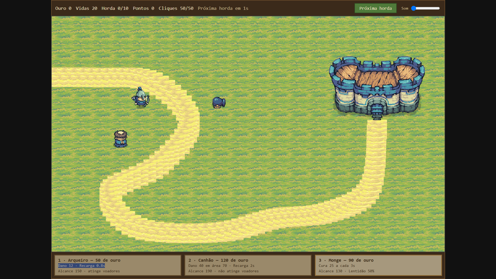
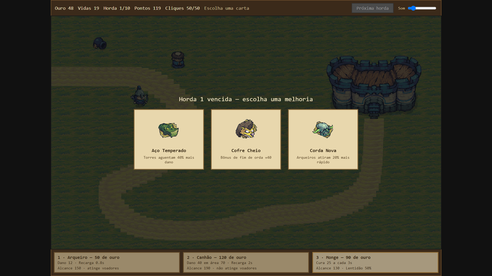
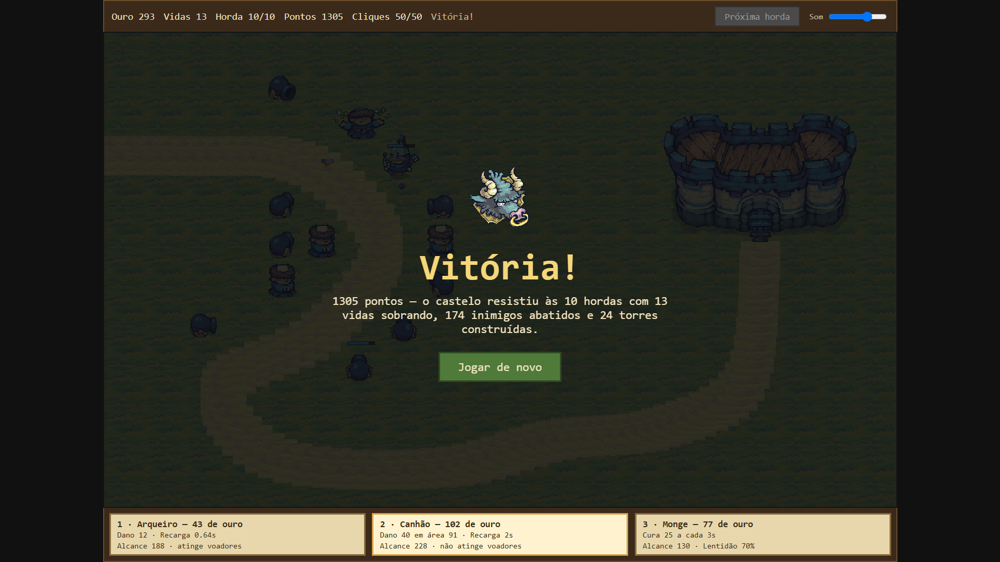

# Tower Defense — Trabalho Prático 1 de Computação Gráfica

**[▶ Jogar agora](https://luccamolinari.github.io/utf-cg-tp1/)** · CEFET · 2026

---

## O jogo

Um tower defense de caminho fixo. Hordas de goblins, morcegos, tartarugas e um
minotauro atravessam uma trilha sinuosa até a ponte levadiça do seu castelo, e
você constrói torres ao longo do caminho para impedir que cheguem lá.

São **10 hordas** e **20 vidas**. As três torres só funcionam juntas — cada uma
resolve um problema que as outras não resolvem. No fim de cada horda você escolhe
uma de três cartas de melhoria, e o efeito vale até o fim da partida.

## Como jogar

| Ação | Como |
|---|---|
| Escolher a torre | Teclas `1`, `2`, `3`, ou clique no card embaixo do mapa |
| Construir | Clique numa célula livre — **verde** aceita, **vermelho** não |
| Ver o alcance | Passe o mouse: numa célula livre mostra o alcance da torre escolhida, sobre uma torre já construída mostra o dela |
| Machucar no dedo | Clique em cima de um inimigo. São **50 cliques na partida inteira** e 10 de dano cada — 5 matam um goblin, 145 matam o chefe |
| Adiantar a horda | Botão **Próxima horda**, para não esperar os 12 segundos |
| Volume | Controle no canto direito da barra de cima, ou em Opções no menu |
| Tela cheia | Botão no menu inicial |

Você começa com **260 de ouro**, e só ganha mais matando inimigos e completando
hordas. Cada inimigo que alcança o castelo custa uma vida.

### As três torres

| Torre | Custo | O que faz | Ponto fraco |
|---|---|---|---|
| **Arqueiro** | 50 | 12 de dano a cada 0,8s, alcance 150. É a **única que acerta alvos aéreos** | Suas flechas quicam na tartaruga e voltam contra ele |
| **Canhão** | 120 | 40 de dano numa área de 70px, alcance 190. Único jeito de ferir a tartaruga | Não enxerga o que voa, e é o alvo preferido dos morcegos |
| **Monge** | 90 | Deixa inimigos 50% mais lentos num raio de 130 e cura 25 de vida das torres vizinhas a cada 3s | Não causa dano nenhum |

### Os inimigos

| Inimigo | Vida | Velocidade | Particularidade |
|---|---|---|---|
| Spear Goblin | 50 | 120 | Rápido e barato, vem em massa |
| Torch Goblin | 90 | 95 | O intermediário |
| Gnoll | 130 | 85 | Resistente |
| **Giant Bat** | 50 | 210 | **Voa direto até o canhão mais próximo e o destrói.** Só o arqueiro alcança |
| **Turtle** | 325 | 55 | **Se recolhe no casco e reflete flechas de volta no arqueiro.** Só o canhão a machuca |
| **Minotauro** | 1450 | 62 | O chefe da horda 10 |

É esse triângulo que sustenta o jogo: o canhão é o dano de verdade, mas morre
para os morcegos; o arqueiro derruba os morcegos, mas se machuca sozinho perto
das tartarugas; e o monge, que não mata ninguém, é quem mantém os dois de pé.

### Pontuação

A pontuação premia quem vence com **poucas torres, muitas vidas e poucos cliques
gastos**:

```
pontos = abates × 10
       × (0,5 + 0,5 × cliques restantes / 50)   piso de metade quando acabam
       × (1 + vidas restantes / 20)             até o dobro com as 20 vidas
       × 20 / (20 + torres construídas)         quanto mais torres, menos vale
```

Vencer com 8 torres e vidas cheias sem clicar dá perto de **2600 pontos**.
Vencer na força bruta com 35 torres dá **535**.

## Media kit





## Criadores

**Nicolas Rodrigues de Vargas** — contato.nicodevargas@gmail.com
**Lucca Molinari** — luccamolinaari@gmail.com

Alunos de Engenharia de Computação no CEFET. Disponíveis para contratação. 🙂

## JORNADA DOS HERÓIS (os dois devs coitados)

A nossa jornada começou com a ideia de fazer um tower defense inspirado em Plants vs Zombies. Mas por algum motivo sobrenatural de última hora pivoteamos a ideia para um jogo mais inspirado em Bloons TD6.

Como todo bom jogo de tower defense, começamos a pensar no mapa. Ideias mirabolantes de mapas com altura(Onde torres específicas teriam maior range vertical e outras horizontais), inimigos que conseguiriam escalar e cortar caminho, inimigos que conseguiriam entrar debaixo da terra... Mas como também todo bom jogo indie, cortamos várias ideias. Afinal, tínhamos uma data de entrega e seria bem difícil implementar tudo, correria risco de entregar algo incompleto(Mas até que com o trabalho adiado, talvez a ideia de inimigos debaixo da terra... Deixa pra lá.)

Voltando para o simples, desenhamos um mapa simples, e tentamos fazer o jogo ficar legal de outros jeitos menos trabalhosos e mais criativos, uma curva principal que todo bom jogador de tower defense vai lotar de tropas e voilá, temos nosso mapa. Primeira barreira vencida.

Agora o negócio foi balancear o jogo. Queríamos novamente dificultar e aprofundar o jogo, queríamos que além de torres defensivas(ou ofensivas, mas o certo seria de combate), queríamos torres que gerariam recursos, fazendo o jogador ter que pensar se investe em economia ou poder de combate, inspirado no girassol do Plants vs Zombies. Mas como tava bem complicado de pensar num jeito bom de fazer isso, descartamos a ideia também. Por fim, o ouro ficou apenas na matança. O dano, range, velocidade das tropas inimigas, fomos comparando com bloons para tentar ter uma ideia. Mas facilmente íamos de o jogo mais fácil para o jogo mais difícil do mundo. Até que achamos um spot adequado. Mas aí, veio a brilhante ideia, vamos mudar a dificuldade com coisas além de números!

O Pedra Papel Tesoura.
Todo jogo tem um "meta", uma estratégias mais forte que outras. E nossa primeira versão, bastava você lotar o jogo de canhões que você ganhava. O monge e o arqueiro eram basicamente inúteis, o jogo com três torres tinha virado apenas um canhão simulator. E foi aí que veio os *MORCEGOS*, tropas aéreas que o canhão não conseguia bater, e ainda mais, *ATACAVA O CANHÃO*, para defender? Arqueiros. A ideia era que o canhão seria sempre sua arma principal, pelo dano alto e em área, mas caro, e necessitaria de uns 3 arqueiros para defender das hordas de morcegos. Mas aí... Os arqueiros ficaram muito fortes. Para combater os morcegos, o arqueiro virou uma máquina de flechas imbatível, que ganhava o jogo sozinho. Então... Muitos ajustes depois. Não chegamos a uma solução para "nerfar" o arqueiro de um jeito que ele conseguia defender o canhão e ao mesmo tempo não ser o mais forte do jogo. Porém, o monge, que servia apenas para deixar as tropas lentas(que ajudava), ainda parecia fraco, você comprava um e já era, esquecia o monge pro resto do jogo. E foi aí que veio a ideia que fechava esse pedra papel tesoura. *AS TARTARUGAS REFLETORAS*, Agora, o inimigo que antes apenas era um tanque lento, refletia flechas, que infligia dano aos arqueiros, fazendo os arqueiros serem limpos e deixando muito difícil, e para balancear? O monge agora cura. Pronto. Essa era a versão final do nosso Pedra Papel Tesoura das três tropas.

Obviamente, como dar para ver no jogo, adicionamos cartas a cada horda. Que só atrapalhou mais o balanceamento, mas como foi apenas número e coisas do tipo, não vale mencionar na história.

Depois do balanceamento, apenas tínhamos que melhorar a nossa HUD que estava patética, para combinar com os Sprites magníficos feito pelo artista Pixel Frog: https://pixelfrog-assets.itch.io/tiny-swords
Sprite essa que eu(Nicolas) comprei meses atrás para desenvolver um jogo souls 2d com um amigo(que acabou não indo pra frente, quem sabe agora depois desse experimento com o tower defense).

E foi isso, resumidamente, as partes "interessantes" do nosso desenvolvimento ao longo dessas semanas. =D

## Como foi feito

**WebGL2 na mão, sem biblioteca e sem build.** Não tem npm, não tem bundler, não
tem engine. São arquivos `.js` soltos que o navegador carrega como módulos.

### Três shaders, três trabalhos

O jogo inteiro é desenhado com programas GLSL pequenos:

1. **Retângulo de cor sólida** — barras de vida, destaque de célula, o escurecido
   das telas e **cada partícula**.
2. **Quad texturizado** — todo sprite do jogo. O mesmo quadrado unitário desenha
   o mapa, os inimigos, as torres e os projéteis; o que muda é um `uniform` que
   diz qual pedaço da spritesheet recortar. Animar é só trocar esse recorte ao
   longo do tempo.
3. **Círculo** — o alcance da torre. Em vez de aproximar a circunferência com
   dezenas de triângulos, o quad cobre o quadrado que envolve o círculo e o
   fragment shader **descarta** os pixels cujo raio passa de 1, reforçando a
   borda. Um shader de oito linhas no lugar de geometria.

O vertex shader é o mesmo em todos: recebe a posição em pixels e converte para o
espaço de recorte do OpenGL, invertendo o Y para que a origem fique no canto
superior esquerdo.

### O caminho é uma curva, não uma lista de esquinas

O trajeto não é feito de segmentos em ângulo reto. São **12 pontos de controle**
interpolados por uma **spline Catmull-Rom**, que gera 265 pontos formando 2101
pixels de curva contínua. A areia é carimbada ao longo dela.

Cada inimigo guarda apenas **quantos pixels já andou**. Para saber onde ele está,
o jogo consulta uma tabela de distâncias acumuladas com busca binária e interpola
entre dois pontos vizinhos. Isso garante velocidade constante mesmo onde a curva
tem pontos mais juntos — sem isso, os inimigos acelerariam nas retas e frenariam
nas curvas fechadas.

Os morcegos são a exceção: como voam para fora da trilha, todo inimigo carrega
também a sua posição em `x` e `y`, atualizada pela curva quando anda no chão e
calculada diretamente quando voa.

### O mapa

Canvas de **1280×768**, dividido numa grade de **20×12 células de 64 pixels**.
Uma célula aceita torre se o centro dela estiver a mais de 64px da curva e não
encostar no castelo — **146 das 240 células**. Essa checagem roda uma vez no
carregamento e fica guardada, então descobrir se dá para construir num lugar é
instantâneo durante a partida.

### Partículas

Quatro efeitos, cada um com a sua própria forma: a **explosão** do canhão sai em
todas as direções e cai; a **faísca** da flecha refletida sobe num leque e
despenca; a **poeira** da construção se espalha para os lados e cresce enquanto
desbota; a **fumaça** da morte sobe e dobra de tamanho. São quadradinhos, não
discos — combina com pixel art e reaproveita o shader de retângulo.

### Som

Os módulos de lógica **não conhecem o áudio**. Eles avisam o que aconteceu por um
callback que, sem ninguém escutando, não faz nada. Isso mantém a lógica do jogo
testável fora do navegador.

Cada efeito tem quatro vozes em rodízio e um intervalo mínimo de 90ms entre
repetições — sem isso, os 887 disparos de arqueiro de uma partida virariam
chiado. Os sons de movimento tocam em loop enquanto existir um inimigo daquele
grupo vivo. A música só começa a carregar no primeiro clique do jogador, porque o
navegador bloqueia áudio antes disso de qualquer jeito.

### Detalhe de textura que muda tudo

As texturas são carregadas com filtro **`NEAREST`**. Com o filtro padrão, que
suaviza, a pixel art do Tiny Swords vira um borrão assim que é redimensionada.

### Os arquivos

```
js/
  renderer.js    contexto WebGL, compilação dos shaders e os desenhadores
  assets.js      carrega os PNGs e sobe como textura
  mapa.js        a spline, o terreno e onde se pode construir
  inimigos.js    tipos, movimento pela curva ou pelo ar, vida e dano
  torres.js      mira, tiro, projéteis e a cura do monge
  ondas.js       as 10 hordas, o ouro, as vidas, a pontuação e o fim da partida
  cartas.js      o baralho de 12 melhorias
  particulas.js  os quatro efeitos
  audio.js       vozes, ambientes e música
  main.js        o laço principal e a HUD
```

## Opcionais implementados

O enunciado pede pelo menos 4. Implementamos **13**, com o texto de cada item
copiado do enunciado:

**Apresentação e gráficos**

1. ⭐ **Texturas animadas**: "você pode criar animações de personagens ou cenário.
   Por exemplo, para inimigo andando, atacando... uma explosão, para os projéteis
   etc"
   → Todos os inimigos têm animação de caminhada; o arqueiro alterna entre parado
   e atirando; o monge tem animação de cura; a tartaruga se recolhe no casco.

2. 💣 **Efeitos de partículas** "para simular explosão, faíscas etc"
   → Explosão do canhão, faíscas da flecha refletida, poeira da construção e
   fumaça da morte.

3. ⭐ **Telas**: "faça um jogo completo, ou seja, implemente telas de splash
   screen, menu inicial, créditos, opções, game over, etc"
   → Menu inicial com Jogar, Opções (volume e língua) e Créditos; tela de vitória
   e tela de derrota, ambas com resumo da partida e botão de jogar de novo; e a
   tela de escolha de carta entre as hordas.

4. **Tela cheia**: "faça com que seja possível colocar em tela cheia e que a
   razão de aspecto do jogo seja sempre mantida, independente das dimensões da
   janela (windowed ou full screen), mas que o jogo ocupe a maior área possível da
   janela e ficando centralizado"
   → Botão no menu inicial. O canvas mantém a proporção 1280×768 e fica
   centralizado, ocupando o máximo que couber.

5. 🌟 **Sons**: "Colocar efeitos sonoros e música de fundo no seu jogo"
   → Música de fundo em loop e 21 efeitos: construção, disparo, impacto, flecha
   quicando, cura, morte de cada tipo de inimigo, ambiente de movimento, perda de
   vida, torre destruída, início de horda e as cartas.

**Inimigos**

6. ⭐ **Inimigos diferentes**: "faça inimigos visual e mecanicamente diferentes,
   como com velocidades distintas, frequência de ataque, dano etc"
   → Seis tipos, com vida de 50 a 1450 e velocidade de 55 a 210. O morcego voa e
   ataca torres, a tartaruga reflete flechas.

7. **Inimigos em ondas**: "crie o conceito de ondas de inimigos (fases) para que
   o jogador possa conciliar momentos de maior tensão ou maior relaxamento (no
   intervalinho entre ondas). As ondas podem ser 'fases curadas' e finitas, ou
   infinitas (com aumento de dificuldade)"
   → 10 hordas curadas, com 12 segundos de preparo entre elas e dificuldade
   crescendo de 400 para 5860 de vida total.

8. 🍔 **Caminhos dos inimigos**: "em vez de sempre vir de fora da tela para o
   centro, crie um caminho (sequência de waypoints) que os inimigos percorrem até
   chegar à torre principal (como a maioria dos tower defense fazem)"
   → Em vez de waypoints retos, uma spline Catmull-Rom de 12 pontos de controle.

**Recursos do jogador**

9. ⭐ **Novas torres**: "deixe o jogador construir novas torres"
   → Qualquer uma das 146 células livres do mapa.

10. ⭐ **Torres diferentes**: "além de haver mais de uma torre, permita ao jogador
   escolher dentre diferentes tipos, como por exemplo uma 'torre de gelo' que
   deixa o inimigo mais lento, ou uma 'torre canhão' que atinge uma área e pode
   causar dano em vários inimigos com cada tiro"
   → Arqueiro, Canhão (dano em área) e Monge (deixa lento e cura).

11. ⭐ **Progressão da torre**: "permita ao jogador melhorar a(s) torre(s)
    eventualmente, por exemplo, aumentando sua cadência, ou seu alcance, ou seu
    dano etc. Uma estratégia interessante é a adotada por jogos 'roguelike' ou
    'roguelite', que é a ideia de oferecer umas 3x opções de upgrade aleatórios ao
    jogador cada vez que ele tiver a oportunidade de melhorar uma torre"
    → Exatamente isso: no fim de cada horda, três cartas sorteadas de um baralho de
    12, e a escolhida vale até o fim da partida.

12. **Moedas**: "crie uma moeda que o jogador adquire, de alguma forma, e que pode
    ser usada para: (a) melhorias na(s) torre(s), ou (b) criar novas torres, ou
    (c) para melhorias do herói, ou para outro motivo interessante"
    → Ouro, ganho matando inimigos e completando hordas, gasto em torres.

13. **Implementação criativa**: "qualquer implementação que não fuja muito do
    pedido, mas que traga elementos novos e interessantes para o seu jogo é
    bem-vinda!"
    → O pedra-papel-tesoura entre as três torres: o morcego caça canhões e só o
    arqueiro o alcança; a tartaruga devolve as flechas do arqueiro e só o canhão a
    fere; o monge cura os dois. Mais o orçamento de 50 cliques e a fórmula de
    pontuação que premia vencer com menos torres.

## Créditos

### Arte

Todos os sprites são do pacote **Tiny Swords**, do artista **Pixel Frog** —
https://pixelfrog-assets.itch.io/tiny-swords

### Música

**Awesomeness**, do OpenGameArt — https://opengameart.org/content/menu-music

### Efeitos sonoros

Todos do **Pixabay**:

| Som | Link |
|---|---|
| Construir arqueiro e monge | https://pixabay.com/pt/sound-effects/filme-e-efeitos-especiais-minecraft-villager-289282/ |
| Construir canhão | https://pixabay.com/pt/sound-effects/filme-e-efeitos-especiais-stone-effect-254998/ |
| Arqueiro atirando | https://pixabay.com/pt/sound-effects/filme-e-efeitos-especiais-arrow-swish-03-306040/ |
| Flecha acertando | https://pixabay.com/pt/sound-effects/filme-e-efeitos-especiais-arrow-impact-87260/ |
| Flecha quicando no casco | https://pixabay.com/pt/sound-effects/filme-e-efeitos-especiais-arrow-twang-01-306041/ |
| Canhão atirando | https://pixabay.com/pt/sound-effects/filme-e-efeitos-especiais-cannon-shot-326182/ |
| Canhão destruído | https://pixabay.com/pt/sound-effects/filme-e-efeitos-especiais-falling-rock-105396/ |
| Monge curando | https://pixabay.com/pt/sound-effects/filme-e-efeitos-especiais-weird-blah-blah-85986/ |
| Morte do goblin | https://pixabay.com/pt/sound-effects/horror-goblin-death-6729/ |
| Morte do morcego | https://pixabay.com/pt/sound-effects/filme-e-efeitos-especiais-little-creature-hurt-sound-295405/ |
| Morte da tartaruga | https://pixabay.com/pt/sound-effects/filme-e-efeitos-especiais-dragon-growl-146631/ |
| Morte do minotauro | https://pixabay.com/pt/sound-effects/natureza-cow-moo-122255/ |
| Morcego voando | https://pixabay.com/pt/sound-effects/natureza-wingflap-fast-2-77739/ |
| Tropas correndo | https://pixabay.com/pt/sound-effects/pessoas-passos-461702/ |
| Tartaruga andando | https://pixabay.com/pt/sound-effects/filme-e-efeitos-especiais-heavy-walking-footsteps-352771/ |
| Minotauro andando | https://pixabay.com/pt/sound-effects/colossal-footsteps-467495/ |
| Perder vida | https://pixabay.com/pt/sound-effects/filme-e-efeitos-especiais-cartoon-scream-1-6835/ |
| Início de horda | https://pixabay.com/pt/sound-effects/musical-shofar-blast-medium-length-two-tone-98247/ |
| Cartas aparecendo | https://pixabay.com/pt/sound-effects/musical-heavenly-choir-of-angels-322708/ |
| Carta escolhida | https://pixabay.com/pt/sound-effects/tecnologia-xp-gain-magic-tone-453274/ |
| Click of shame | https://pixabay.com/pt/sound-effects/pessoas-fart-83471/ |

Os shaders, a curva do caminho, as partículas, a lógica do jogo e a interface
foram escritos para este trabalho.
